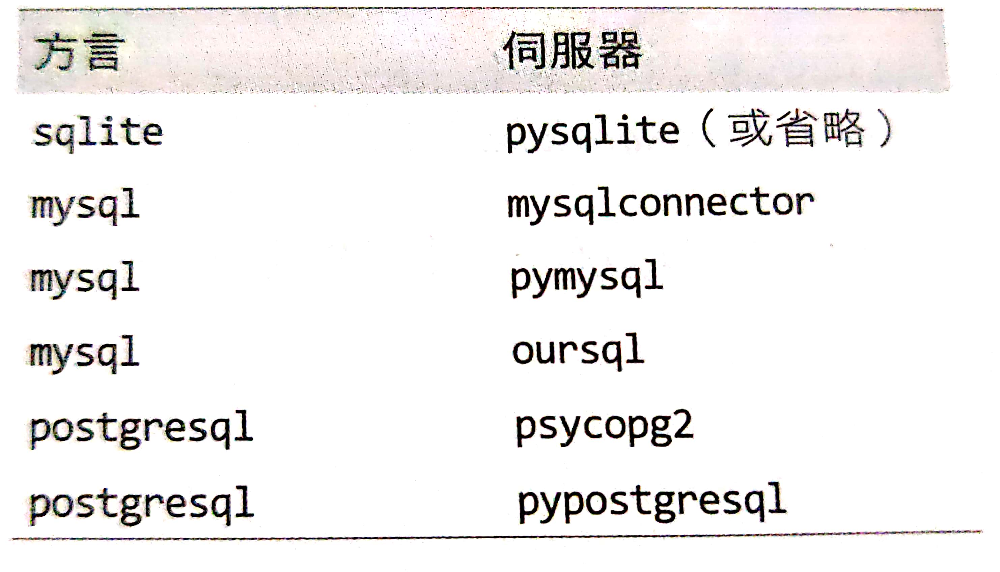

# sqlAlchemy 
- 安裝: 
    ```Python
    pip install sqlalchemy
 
##  連結字串

```text
dialect + driver ://user:password @ host : port /dbname
```
- dialect - 資料庫類型
- driver - 資料庫驅動程式
- user @ password - 資料庫使用者名稱/密碼
- host與port - 資料庫伺服器的位置(當它不是伺服器的標準數定時,才需要使用port)
- dbname - 伺服器資料庫

